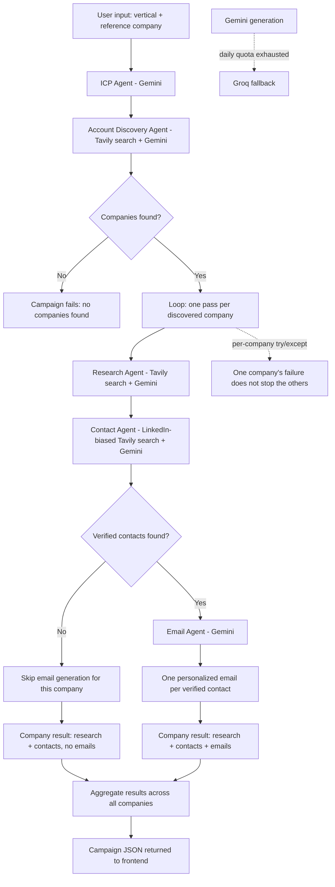

# submission

## What I built

An outbound BDR (Business Development Rep) automation tool. Given a
target vertical and one reference company, it runs a five-stage agent
pipeline that identifies an Ideal Customer Profile, discovers real
companies matching it, researches each one, finds verified
decision-makers, and drafts a personalized cold email per contact —
producing a ready-to-review prospect list instead of a BDR building one
by hand.

Backend: FastAPI (Python), orchestrating five agents backed by Gemini
(with a Groq fallback) for generation and Tavily for web search.
Frontend: React/Vite, submitting a campaign and rendering the returned
research, contacts, and draft emails per company.

## Architecture / Flow

**Note on this diagram:** this reflects what the codebase actually
implements — a linear per-company pipeline with two explicit guardrails
(skip email generation with no verified contacts; isolate failures
per-company) and one reliability fallback (Gemini to Groq). I did not
get confirmation from the participant on whether anything here should be
represented differently (parallel stages, additional decision points,
or a different data handoff) — if the real design intent differs from
what's shown, this diagram should be corrected before final submission.

## Why this solves the brief

_I don't have the assignment PDF (`FlytBase_Outbound_BDR_-_Hackathon_Problem_Statement.pdf`) in this session, so this section is based on the general outbound-BDR framing implied by the codebase itself, not a line-by-line match against the brief's stated requirements. If the brief specifies criteria not covered here, add them._

The core outbound BDR workflow — figure out who to sell to, find real
companies that fit, research them, find the right people, and write a
relevant first outreach — is broken into five discrete agents rather
than one large prompt, so each step can be grounded in real search
results where accuracy matters (which companies exist, who actually
works there) and reasoned freely where it doesn't (defining an ICP).
Two explicit guardrails — never inventing a LinkedIn URL, never writing
an email against a fabricated contact — are enforced in code, not just
prompted for.

## Evidence from the codebase

- `backend/app/agents/orchestrator.py` — drives the per-company loop and
  isolates failures with try/except so one company's error doesn't
  drop the others from the campaign.
- `backend/app/agents/icp_agent.py` — defines the ICP via a single
  schema-constrained Gemini call.
- `backend/app/agents/account_agent.py` — builds a Tavily query from the
  ICP, extracts up to 5 real candidate companies from search results.
- `backend/app/agents/research_agent.py` — per-company search + Gemini
  summarization into a fixed schema (summary, initiatives, digital
  transformation, ESG, operational challenges, interesting facts).
- `backend/app/agents/contact_agent.py` — LinkedIn-biased search; only
  fills a contact's `linkedin` field if it matches an actual result URL,
  explicitly instructed never to guess one.
- `backend/app/agents/email_agent.py` — returns `{"emails": []}` and
  skips generation entirely when `contacts` is empty, specifically to
  avoid writing an email against an invented persona.
- `backend/app/services/llm.py` — Gemini-primary/Groq-fallback logic,
  distinguishing per-minute rate limits (retry with backoff) from daily
  quota exhaustion (fail over to Groq immediately).
- `backend/app/services/search.py` — Tavily wrapper that returns an
  empty result set on failure instead of raising.
- `backend/app/routes/campaign.py` + `backend/app/main.py` — the single
  `POST /campaign/run` endpoint and FastAPI app wiring the above
  together.

## Demo / results

**Placeholder — needs participant input.** I have not been given a
confirmed real run to report on. Before submitting, replace this section
with:

- The vertical + reference company you tested with
- How many companies / contacts / emails the run actually returned
- Any notable behavior observed (e.g. a company where contact discovery
  came back empty and email generation correctly skipped it)

`frontend/src/mock/results.js` contains an "Antofagasta Minerals"
example, but this was built as UI fixture data before the backend
existed — it is **not** included here as a real result since that
wasn't confirmed.

## Notes and limitations

- The account discovery step caps results at 5 companies per campaign
  (`account_agent.py`), so the pipeline is scoped to a small, reviewable
  batch rather than broad-net prospecting.
- Contact discovery relies on a `site:linkedin.com/in` search pattern;
  companies with a limited public LinkedIn footprint may return few or
  no verified contacts, which correctly results in no email for that
  company rather than a fabricated one.
- Research quality depends on what Tavily surfaces for a given company
  in the current search window — a company with little recent public
  coverage will get a thinner research brief.
- The LLM fallback (Gemini → Groq) only triggers on daily quota
  exhaustion, not on every error type — a genuine bad-request or
  malformed-JSON error from Gemini is raised rather than silently
  retried on Groq.
